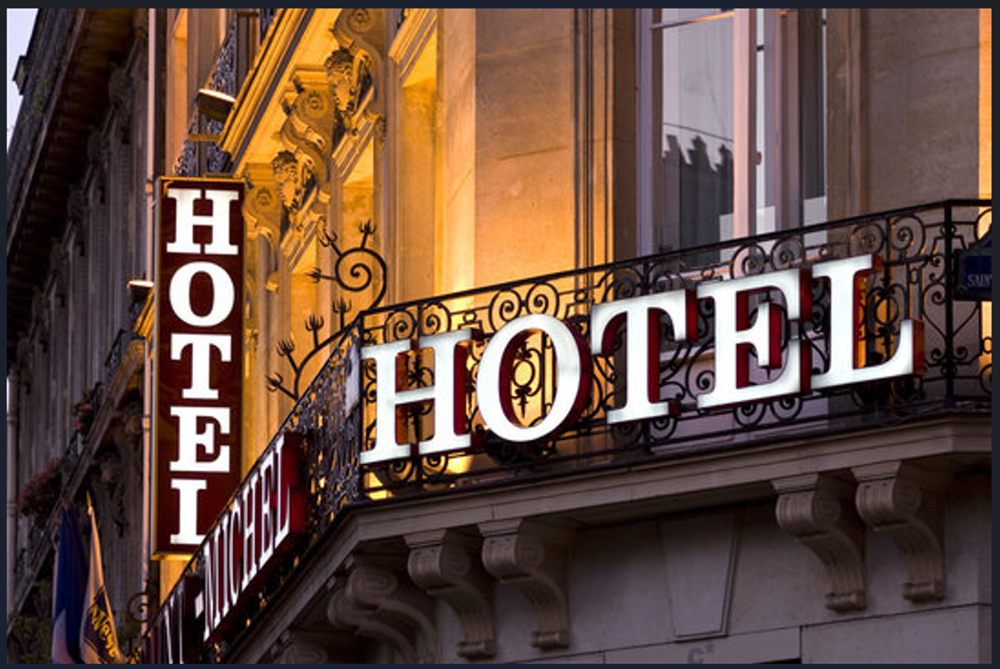

# Hotel-Booking-Analysis

Explore hotel data using Python and libraries like Pandas, Matplotlib, and Seaborn. The project aims to analyze the dataset, uncover trends in hotel bookings, and draw meaningful conclusions about factors influencing the hotel business.

# Dataset
- This data set contains booking information for a city hotel and a resort hotel, and includes information such as when the booking was made, length of stay, the number of adults, children, and/or babies, and the number of available parking spaces, among other things.

# Key Steps
1. data overview
2. Data loading and preprocessing
3. Data analysis and exploration
4. Data visualization using Matplotlib and Seaborn
5. conclusion

# Key Questions:
1. Which type of hotel is mostly prefered by the guests?
2. What is the pecentage of cancellation?
3. What is the Percentage of repeated guests?
4. Which type of food is mostly preferred by the guests?
5. In which month most of the bookings happened?
6. Which year had the highest bookings?
7. Which hotel type has the highest ADR?
8. which hotel has longer waiting time?
9. What is optimal stay length in both types of hotel?
10. Which distribution channel contributed more to ADR in order to increase the income?
11. Which Market Segment has the higest cancellation rate?
12. Correlation Heatmap

# **🔍✨Conclusion**
1. City hotels are the most preferred hotel type by the guests. We can say City hotel is the busiest hotel.
2.	27.5 % bookings were got cancelled out of all the bookings.
3. Only 3.9 % people were revisited the hotels. Rest 96.1 % were new guests. Thus retention rate is low.
4. BB( Bed & Breakfast) is the most preferred type of meal by the guests.
5. August month has most bookings followed by July.
6. Most of the bookings for City hotels and Resort hotel were happened in 2016.
7. City hotel has highest ADR. Highest ADR means more revenue.
8. Waiting time period for City hotel is high as compared to resort hotels. That means city hotels are much busier than Resort hotels.
9. Optimal stay in both the type hotel is less than 7 days. Usually people stay for a week.
10. GDS distribution channel contributed most in ADR in city hotel but no contribution in resort hotel
11.  'Online T/A' has the highest cancellation in both type of cities
12.  arrival_date_year and arrival_date_week_number columns has negative correlation which is -0.51.
13.  stays_in_weel_nights and total_stays has positive correlation which is 0.95.
